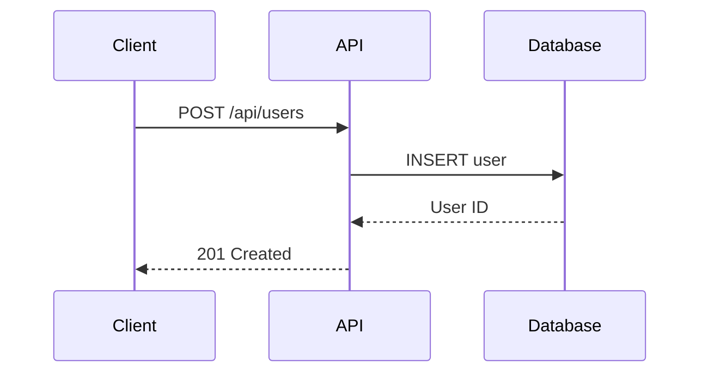

# API Documentation

This document describes the REST API endpoints for our application.

## Related Documents
- [Project Overview](./test.md) - System architecture overview
- [User Guide](./user-guide.md) - End user documentation

## Authentication

All API endpoints require authentication via Bearer token.

```
Authorization: Bearer <your-token>
```

## Endpoints

### GET /api/users
Returns a list of all users.

**Response:**
```json
{
  "users": [
    {
      "id": 1,
      "name": "John Doe",
      "email": "john@example.com"
    }
  ]
}
```

### POST /api/users
Creates a new user.

**Request Body:**
```json
{
  "name": "Jane Smith",
  "email": "jane@example.com"
}
```

## API Flow Diagram



## Error Handling

| Status Code | Description |
|-------------|-------------|
| 400 | Bad Request |
| 401 | Unauthorized |
| 404 | Not Found |
| 500 | Internal Server Error |

For more information about the system architecture, see the [Project Overview](./test.md).