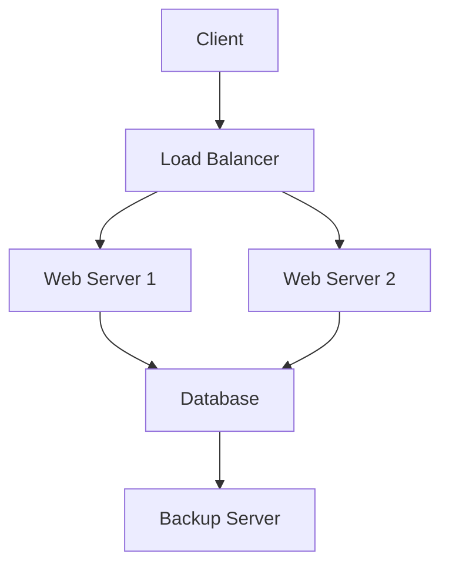

# Project Overview

This document gives a brief overview of the system architecture.

## Table of Contents
- [Related Documents](#related-documents)
- [Architecture Diagram](#architecture-diagram)
- [System Components](#system-components)
  - [Load Balancer](#load-balancer)
  - [Web Servers](#web-servers)
  - [Database](#database)
- [Performance Metrics](#performance-metrics)
- [Security Considerations](#security-considerations)
- [Additional Resources](#additional-resources)

## Related Documents
- [API Documentation](./api-documentation.md) - REST API reference
- [User Guide](./user-guide.md) - End user documentation

## Architecture Diagram

## System Components

### Load Balancer
Distributes incoming requests across multiple web servers for high availability.

### Web Servers
Handle HTTP requests and serve the application content.

### Database
Stores application data with automatic backups.

## Performance Metrics

Our system handles:
- **Throughput**: 10,000 requests per second
- **Latency**: 99th percentile under 50ms
- **Uptime**: 99.9% availability SLA
- **Scalability**: Auto-scaling from 2 to 50 instances

### Monitoring

We use comprehensive monitoring including:
- Application Performance Monitoring (APM)
- Real User Monitoring (RUM)
- Infrastructure monitoring
- Custom business metrics

## Security Considerations

Security is implemented at multiple layers:

### Network Security
- SSL/TLS encryption for all connections
- WAF (Web Application Firewall) protection
- DDoS protection via cloud provider

### Application Security
- Input validation and sanitization
- SQL injection prevention
- XSS protection headers
- Rate limiting per user/IP

### Data Security
- Encryption at rest for sensitive data
- Regular security audits and penetration testing
- GDPR compliance for user data

## Additional Resources

For implementation details, see the [API Documentation](./api-documentation.md).

For end-user instructions, check the [User Guide](./user-guide.md).

---

*Jump back to [Table of Contents](#table-of-contents) | Go to [Architecture Diagram](#architecture-diagram)*

