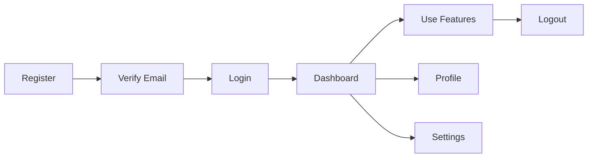

# User Guide

Welcome to the user guide for our application!

## Navigation
- [API Documentation](./api-documentation.md) - For developers
- [Project Overview](./test.md) - System architecture

## Getting Started

### Step 1: Account Setup
1. Visit the registration page
2. Fill in your details
3. Verify your email address

### Step 2: First Login
1. Go to the login page
2. Enter your credentials
3. You'll be redirected to the dashboard

### Step 3: Basic Usage
Once logged in, you can:
- View your profile
- Manage your settings
- Access the main features

## Feature Overview

### Dashboard
The dashboard provides an overview of your account activity.

### Profile Management
Update your personal information and preferences.

### Settings
Configure application settings to your liking.

## User Journey

## Troubleshooting

### Common Issues

**Problem:** Cannot login
**Solution:** Check your email and password, or reset your password

**Problem:** Email not received
**Solution:** Check your spam folder

**Problem:** Feature not working
**Solution:** Try refreshing the page or contact support

## Support

If you need help:
1. Check this user guide
2. Review the [API Documentation](./api-documentation.md) if you're a developer
3. Contact our support team

For technical details about the system, refer to the [Project Overview](./test.md).

---

*Last updated: $(date)*